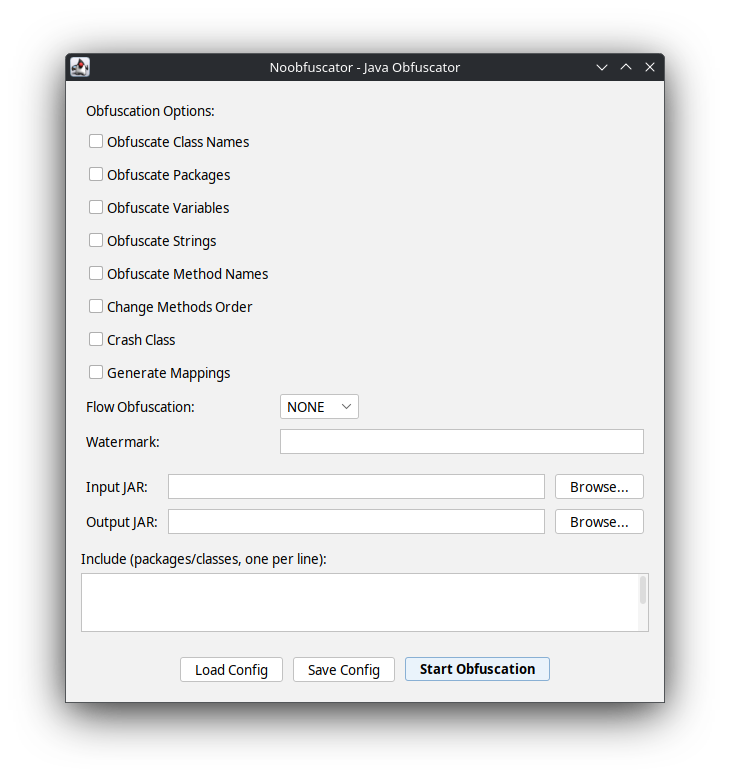

<div align="center">

# 🛡️ Noobfuscator

[](https://opensource.org/licenses/MIT)
[](https://openjdk.java.net/)
[](https://asm.ow2.io/)

</div>

> Simple, lightweight, and effective Java bytecode obfuscator with modern GUI. Designed to protect your Java applications by making code less readable while maintaining full functionality.



---

## 📋 Table of Contents

- [Features](#-features)
- [Requirements](#-requirements)
- [Quick Start](#-quick-start)
- [Obfuscation Options](#-obfuscation-options)
- [Building](#-building)
- [Contributing](#-contributing)
- [License](#-license)

---

## ✨ Features

- 🔒 **Class Name Obfuscation** - Renames classes to unreadable names
- 📦 **Package Obfuscation** - Obfuscates package names and structure
- 🔤 **Method Name Obfuscation** - Renames methods while preserving functionality
- 📝 **String Obfuscation** - Encrypts string literals in bytecode
- 🔢 **Variable Obfuscation** - Renames local variables and parameters
- 🔀 **Method Reordering** - Changes method order to confuse reverse engineers
- 🌊 **Control Flow Obfuscation** - Adds dead code and complex control flow (EASY/HEAVY modes)
- 💧 **Watermarking** - Adds custom prefixes to obfuscated names
- 🗺️ **Mappings Generation** - Generates mapping files for debugging
- 🎯 **Pattern Matching** - Selective obfuscation using include patterns
- 🎨 **Modern GUI** - User-friendly Swing interface with FlatLaf
- ⚡ **Fast Processing** - Efficient bytecode manipulation using ASM

---

## 📦 Requirements

- **Java**: 17 or higher
- **Build Tool**: Gradle (for building from source)

---

## 🚀 Quick Start

### Running the Application

1. Download the latest release JAR file
2. Run with Java:
   ```bash
   java -jar {obfuscator-jar-file}.jar
   ```

### Basic Usage

1. **Select Input JAR** - Choose the JAR file you want to obfuscate
2. **Configure Options** - Enable desired obfuscation features
3. **Set Output Path** - Specify where to save the obfuscated JAR
4. **Configure Include Patterns** (optional) - Specify which packages/classes to obfuscate
5. **Start Obfuscation** - Click "Start Obfuscation" and wait for completion

### Configuration

The application automatically saves your settings to `settings.json` in the working directory. You can:
- **Load Config** - Restore previous settings
- **Save Config** - Manually save current settings

---

## ⚙️ Obfuscation Options

### Class & Package Obfuscation

- **Obfuscate Class Names** - Renames classes to random, unreadable names
- **Obfuscate Packages** - Obfuscates package structure and names
- **Watermark** - Adds custom prefix to all obfuscated names (e.g., `TEST_`)

### Method & Variable Obfuscation

- **Obfuscate Method Names** - Renames methods (excluding constructors and overrides)
- **Obfuscate Variables** - Renames local variables and method parameters
- **Change Methods Order** - Randomizes method order in classes

### String Obfuscation

- **Obfuscate Strings** - Encrypts string literals in bytecode, making them harder to extract

### Control Flow Obfuscation

- **Flow Obfuscation**: 
  - `NONE` - No control flow obfuscation
  - `EASY` - Adds simple dead code and unnecessary jumps
  - `HEAVY` - Adds complex control flow structures and fake conditions

### Additional Features

- **Crash Class** - Inserts a crash class that causes errors when decompiled
- **Generate Mappings** - Creates a JSON mapping file for reverse lookups
- **Include Patterns** - Specify which packages/classes to obfuscate (one per line)

---

## 🏗️ Building

### Prerequisites

- Java 17+
- Gradle 8.0+

### Build Steps

1. Clone the repository:
   ```bash
   git clone https://github.com/neziw/Noobfuscator.git
   cd Noobfuscator
   ```

2. Build the project:
   ```bash
   ./gradlew build
   ```

3. Create shadow JAR:
   ```bash
   ./gradlew shadowJar
   ```

4. The executable JAR will be in `build/libs/`

### Development

```bash
# Run the application
./gradlew run

# Build without tests
./gradlew build -x test
```

---

## 🎯 Design Philosophy

**Noobfuscator** is designed to be **simple yet effective**. While it may not match the complexity of commercial obfuscators, it provides:

- ✅ **Simplicity** - Easy to use, no complex configuration
- ✅ **Effectiveness** - Makes code significantly harder to read and reverse engineer
- ✅ **Reliability** - Maintains code functionality while obfuscating
- ✅ **Open Source** - Transparent and modifiable
- ✅ **Lightweight** - Minimal dependencies, fast processing

Perfect for:
- Protecting intellectual property in Java applications
- Making reverse engineering more difficult
- Learning bytecode manipulation techniques
- Small to medium Java projects

---

## 🤝 Contributing

Contributions are welcome! Please feel free to submit a Pull Request.

1. Fork the repository
2. Create your feature branch (`git checkout -b feature/amazing-feature`)
3. Commit your changes (`git commit -m 'Add some amazing feature'`)
4. Push to the branch (`git push origin feature/amazing-feature`)
5. Open a Pull Request

---

## 📄 License

This project is licensed under the MIT License - see the [LICENSE](LICENSE) file for details.

---

## 🙏 Acknowledgments

- Built with [ASM](https://asm.ow2.io/) for bytecode manipulation
- GUI powered by [FlatLaf](https://www.formdev.com/flatlaf/)
- JSON handling with [Gson](https://github.com/google/gson)

---

## 📞 Support

If you encounter any issues or have questions, please open an issue on the GitHub repository.

---

**Made with ❤️ by [neziw](https://github.com/neziw)**
